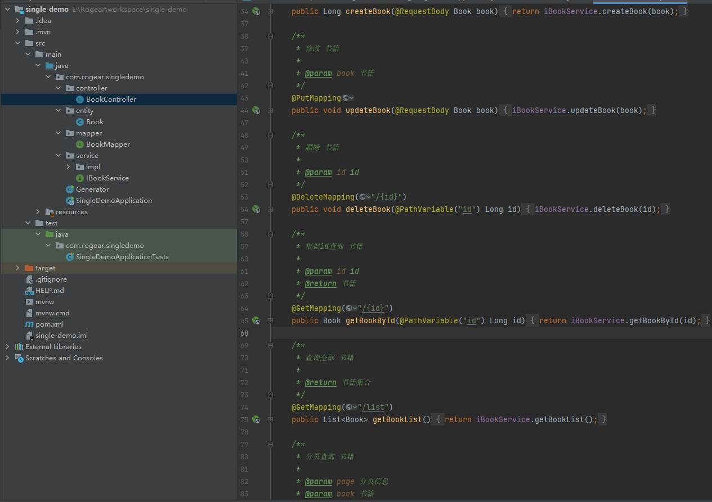

# 为什么要写这个项目

mybatis-plus-generator可以生成controller、service、serviceImpl和entity，但是使用的时候有两点不好用：

1. 生成的controller、service和serviceImpl是空的内容，没有内容。当然官方说可以自定义模板，然后再去生成；
2. 只能生成controller、service、serviceImpl和entity，不能生成别的代码。

基于以上2点，所以写了template-generator这个项目。

# 如何使用template-generator

mybatis-plus原有的功能不受影响，该怎么用还是怎么用。<a herf="https://baomidou.com/">mybatis-plus官网</a>

创建一个项目，加载依赖
```java
        <dependency>
            <groupId>com.mysql</groupId>
            <artifactId>mysql-connector-j</artifactId>
            <version>8.0.33</version>
        </dependency>

        <dependency>
            <groupId>com.baomidou</groupId>
            <artifactId>mybatis-plus</artifactId>
            <version>3.5.5</version>
        </dependency>

        <dependency>
            <groupId>com.baomidou</groupId>
            <artifactId>mybatis-plus-generator</artifactId>
            <version>template-generator-1.0.0</version>
        </dependency>

        <dependency>
            <groupId>org.apache.velocity</groupId>
            <artifactId>velocity</artifactId>
            <version>1.7</version>
        </dependency>
```
然后创建一个main方法进行配置，例如：
```java
    public static void main(String[] args) {
    FastAutoGenerator.create("jdbc:mysql://127.0.0.1:3306/generator?serverTimezone=GMT%2b8&useUnicode=true", "root", "root")
    .globalConfig(builder -> {
    builder.author("Rogear") // 设置作者
//                    .enableSwagger() // 开启 swagger 模式
//                    .enableSpringdoc() // 开启 springdoc 模式
    .dateType(DateType.ONLY_DATE)
    .outputDir(System.getProperty("user.dir") + "\\src\\main\\java") // 指定输出目录
    .disableOpenDir();
    })
    .packageConfig(builder -> {
    builder.parent("com.rogear.singledemo") // 设置父包名
    .moduleName(null) // 设置父模块名
    // 设置mapperXml生成路径
    .pathInfo(Collections.singletonMap(OutputFile.xml, System.getProperty("user.dir") + "\\src\\main\\resources\\mapper\\")); // 设置mapperXml生成路径
    })
    .strategyConfig(builder -> {
    builder.controllerBuilder().enableRestStyle();
//                builder.serviceBuilder().formatServiceFileName("%sService"); // 去掉service接口首字母I
//                builder.entityBuilder().enableLombok();
//                builder.mapperBuilder().enableBaseResultMap();
//                builder.addTablePrefix("ud_");
    builder.addInclude("book");
//                    builder.entityBuilder().superClass(BaseEntity.class);
//                    builder.entityBuilder().addIgnoreColumns("id", "archived", "update_time", "create_time", "version");
    })
    .templateConfig(builder -> {
//                builder.disable(TemplateType.CONTROLLER); // 不生成controller
//                builder.controller("controller123.java.vm");  // 使用制定模板生成controller
//                    builder.otherTemplatePath(System.getProperty("user.dir") + "\\module-demo\\src\\main\\resources\\templates");
    // 不生成对应方法
//                builder.disable(TemplateType.CREATE_FUNCTION, TemplateType.UPDATE_FUNCTION, TemplateType.DELETE_FUNCTION, TemplateType.GET_BY_ID_FUNCTION, TemplateType.GET_LIST_FUNCTION, TemplateType.GET_PAGE_FUNCTION);
    })
    .execute();

    }
```
然后运行main方法生成代码（注意修改数据库连接、文件路径等）

默认会生成新增、修改、删除、根据id查询、list查询和分页查询方法，如果不需要对应的方法，可以在main方法中修改配置。例如不想生成新增方法，可以如下配置：
```java
builder.disable(TemplateType.CREATE_FUNCTION)
```

如果修改文件模板，方式和mybatis-plus一样，自定义文件模板放到resources/template目录下即可。如果想生成其它文件，可以编写对应的模板文件，生成的代码文件目录结构与模板一致。

生成文件的名称是“对象名称+模板名称”，如果希望对象的名称不在最前面可以在模板名称中使用“[entity]”进行占位。

# 注意

如果是多模块的工程使用template-generator，需要在配置中指定模板的路径，例如：
```java
builder.otherTemplatePath(System.getProperty("user.dir") + "\\module-demo\\src\\main\\resources\\templates");
```
